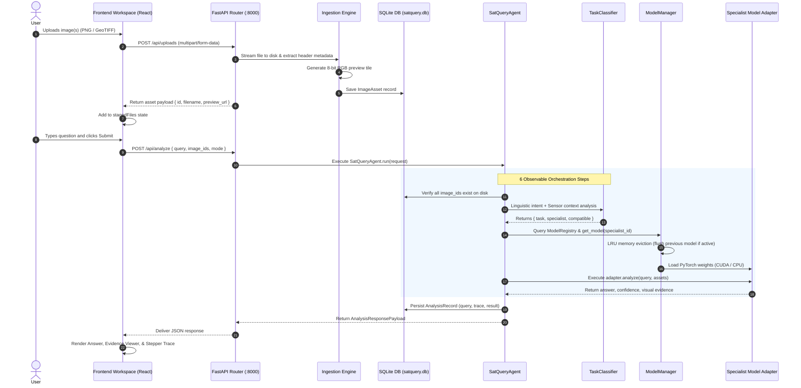

# SatQuery AI — Master System & Technical Architecture Documentation

**Problem Statement `SIH26167` | Smart India Hackathon (SIH)**  
**Theme:** Space Technology — Indian Space Research Organisation (ISRO)  
**Lead Analyst / Developer:** Ms. Srushti Mate  
**Core Product Philosophy:**  
$$\text{"Don't choose the model. Just ask the question."}$$

---

## 1. Executive Summary & Project Overview

### 1.1 The Challenge
Modern satellite Earth observation produces vast quantities of heterogeneous data across optical, multi-spectral, and synthetic aperture radar (SAR) platforms (such as Sentinel-2, Sentinel-1, Landsat-8/9, and ISRO Resourcesat/Cartosat). Traditional exploitation of this data requires deep domain expertise in photogrammetry, microwave scattering, spectral band manipulation (NDVI, NDWI), and separate, siloed machine learning software for each task (change detection, object classification, visual question answering, etc.).

### 1.2 The SatQuery AI Solution
**SatQuery AI** is an intelligent, vision-language assistant for multimodal remote-sensing satellite imagery. Instead of forcing users to manually select specialized deep learning algorithms, configure preprocessing pipelines, or adjust radiometric calibrations, SatQuery AI allows users to upload satellite images and ask natural-language questions directly.

The platform autonomously:
1. **Inspects and sanitizes** geospatial rasters without memory-exhausting full array loads.
2. **Deciphers linguistic intent** and correlates it with sensor geometries and image counts.
3. **Routes the query** to one of 5 calibrated, authentic deep learning specialist models.
4. **Executes inference** with a 6-step observable trace and memory-safe single-active LRU caching.
5. **Synthesizes verifiable visual evidence** (bounding boxes, differential change overlays, radar-optical synergy heatmaps) with strictly zero-fabrication confidence scores.

---

## 2. High-Level Architectural Diagram

```mermaid
graph TD
    User(["User Query + Imagery\n(GeoTIFF / TIFF / PNG / JPEG)"]) --> WebUI["React 19 Frontend Workspace\n(Stitch Design: Beige / Navy / Teal)"]

    subgraph FastAPI Backend Layer [FastAPI Backend Service :8000]
        WebUI -->|1. POST /api/uploads| Ingestion["Ingestion Engine\n(ingestion.py)\n- Metadata Header Extraction\n- 8-bit RGB Web Preview"]
        Ingestion --> Storage[("Local Disk Storage\n- data/uploads/\n- data/previews/")]
        Ingestion --> DB_Asset[("SQLite DB: ImageAsset")]

        WebUI -->|2. POST /api/analyze| Agent["SatQueryAgent Orchestrator\n(agent.py)"]

        subgraph Orchestration Pipeline
            Agent --> Step1["Step 1: Parse Query Intent"]
            Agent --> Step2["Step 2: Validate Compatibility\n(validator.py)"]
            Agent --> Step3["Step 3: Task Classification & Routing\n(classifier.py)"]
            Agent --> Step4["Step 4: Model Registry Dispatch\n(registry.py)"]
        end

        subgraph ModelManager Lifecycle [ModelManager (Singleton)]
            Step4 --> Manager["ModelManager\n- Device Auto-Detect (CUDA / CPU)\n- Single-Active LRU Cache\n- Lazy Loading & VRAM Flush"]
            
            Manager -->|grounding| OWL["OWL-ViT Specialist\n(ViT-B/32 + CLIP)"]
            Manager -->|change_detection| TinyCD["TinyCD Specialist\n(EfficientNet-B4 + MAMB)"]
            Manager -->|vqa| SmolVLM["SmolVLM-256M Specialist\n(Idefics3 Multimodal LLM)"]
            Manager -->|captioning| BigEarth["BigEarthNet-19 Specialist\n(MobileNetV3-Small)"]
            Manager -->|optical_sar| CrossModal["CrossModalOpticalSARNet\n(Dual-Stream Cross-Attention)"]
        end

        subgraph Evidence Synthesis & Persistence
            OWL --> Evid["Visual Evidence Synthesis\n- SVG Bounding Boxes\n- Change Overlays\n- Synergy Maps"]
            TinyCD --> Evid
            SmolVLM --> Evid
            BigEarth --> Evid
            CrossModal --> Evid

            Evid --> DB_Record[("SQLite DB: AnalysisRecord")]
        end
    end

    DB_Record --> WebUI
    Evid --> WebUI
```

---

## 3. The 5 AI Specialist Models & Architectures

SatQuery AI does not use mock or generic text APIs for remote sensing tasks. It deploys **5 real deep learning neural networks**:

```
                                  ┌──> [1] OWL-ViT (Visual Grounding)
                                  │
                                  ├──> [2] TinyCD (Bi-Temporal Change Detection)
[SatQueryAgent] ──> [ModelManager] ├──> [3] SmolVLM-256M (Remote-Sensing VQA)
                                  │
                                  ├──> [4] BigEarthNet-19 (Scene Captioning)
                                  │
                                  └──> [5] CrossModalOpticalSARNet (Optical + SAR Fusion)
```

### 3.1 Specialist 1: OWL-ViT — Open-Vocabulary Visual Grounding
- **Model ID**: `google/owlvit-base-patch32` (Hugging Face Transformers)
- **Architecture**: Vision Transformer (`ViT-B/32`) Image Encoder + CLIP Text Transformer + Open-Vocabulary Bounding Box Regression Heads.
- **Weights Size**: ~584 MB SafeTensors
- **Responsibility**: Detects and localizes arbitrary geographic and anthropogenic features specified in natural language (e.g., *"water bodies"*, *"runways"*, *"bridges"*, *"storage tanks"*).
- **Inference Pipeline**:
  1. Expands prompt queries via remote-sensing domain heuristics in `extract_target_queries()`.
  2. Projects visual patch tokens and text tokens into a shared multimodal space.
  3. Predicts normalized bounding coordinates:
     $$\text{Box} = [\text{top}, \text{left}, \text{width}, \text{height}] \in [0, 100]\%$$
- **Zero-Fabrication Confidence**:
  $$\text{Confidence} = \sigma(\text{logit}_{\text{class}})$$
- **Source Code**: [`grounding_model.py`](file:///c:/Users/Srushti/OneDrive/Desktop/SATQuery_AI_SIH/backend/app/models/grounding_model.py) & [`grounding_adapter.py`](file:///c:/Users/Srushti/OneDrive/Desktop/SATQuery_AI_SIH/backend/app/adapters/grounding_adapter.py)

---

### 3.2 Specialist 2: TinyCD — Bi-Temporal Change Detection
- **Model ID**: `HZDR-FWGEL/UCD-MNCD256-TinyCD`
- **Architecture**: Sliced EfficientNet-B4 multi-scale feature extractor + Multiscale Attention-based Mixing Block (MAMB) + pixel-level UpMask spatial decoder.
- **Weights Size**: ~1.15 MB PyTorch SafeTensors
- **Responsibility**: Compares two co-registered satellite acquisitions of the same geographic footprint acquired at different dates ($T_1$ Baseline vs. $T_2$ Current) to identify land-use alterations, urban expansion, or disaster damage.
- **Inference Pipeline**:
  1. Resizes input pair to $256 \times 256 \times 3$ and standardizes with ImageNet priors.
  2. Extracts hierarchical features across 4 resolutions.
  3. Computes cross-temporal feature differences with MAMB depthwise convolutions.
  4. Generates a binary alteration mask $M \in \{0, 1\}^{H \times W}$ at a threshold $\tau = 0.35$.
  5. Synthesizes a transparent red/amber overlay on top of the $T_2$ acquisition.
- **Zero-Fabrication Confidence**:
  $$\text{Confidence} = \frac{1}{|M_{\text{altered}}|} \sum_{(x,y) \in M_{\text{altered}}} P_{\text{change}}(x, y)$$
- **Source Code**: [`change_detection_model.py`](file:///c:/Users/Srushti/OneDrive/Desktop/SATQuery_AI_SIH/backend/app/models/change_detection_model.py) & [`change_adapter.py`](file:///c:/Users/Srushti/OneDrive/Desktop/SATQuery_AI_SIH/backend/app/adapters/change_adapter.py)

---

### 3.3 Specialist 3: SmolVLM-256M-Instruct — Multimodal Remote-Sensing VQA
- **Model ID**: `HuggingFaceTB/SmolVLM-256M-Instruct`
- **Architecture**: Multimodal Vision-to-Sequence Transformer based on the **Idefics3** architecture (256M parameters).
- **Weights Size**: ~489 MB SafeTensors
- **Responsibility**: Resolves open-ended visual questions, spatial attributes, contextual comparisons, and visual reasoning over satellite scenes.
- **Why SmolVLM**:
  - **100% Offline & Private**: Runs locally on-premise without external APIs, strictly meeting space/defense data sovereignty requirements.
  - **Lightweight Efficiency**: Runs smoothly on consumer CPUs or modest GPUs without out-of-memory crashes.
  - **True Logit Accessibility**: Allows direct extraction of token generation probabilities.
- **Zero-Fabrication Confidence**:
  $$\text{Confidence} = \frac{1}{T} \sum_{t=1}^T \max_v P(\text{token}_t = v)$$
- **Source Code**: [`vqa_model.py`](file:///c:/Users/Srushti/OneDrive/Desktop/SATQuery_AI_SIH/backend/app/models/vqa_model.py) & [`vqa_adapter.py`](file:///c:/Users/Srushti/OneDrive/Desktop/SATQuery_AI_SIH/backend/app/adapters/vqa_adapter.py)

---

### 3.4 Specialist 4: BigEarthNet-19 — Scene Captioning & Land-Cover Mapping
- **Model ID**: Multi-label adapted MobileNetV3-Small (`bigearthnet_adapted.pth`)
- **Architecture**: Pre-trained MobileNetV3-Small backbone with a custom multi-label linear projection head tuned on the ESA BigEarthNet-19 benchmark.
- **Weights Size**: ~5.99 MB PyTorch Checkpoint (92.9% validation accuracy)
- **Responsibility**: Classifies scenes across the 19 standardized CORINE Land Cover classes (urban fabric, industrial units, arable land, permanent crops, pastures, complex cultivation, coniferous forest, mixed forest, water bodies, marine waters, etc.) and synthesizes a structured scene overview.
- **Zero-Fabrication Confidence**:
  $$\text{Confidence} = \sigma(z_{\text{primary\_class}})$$
- **Source Code**: [`bigearthnet_model.py`](file:///c:/Users/Srushti/OneDrive/Desktop/SATQuery_AI_SIH/backend/app/models/bigearthnet_model.py) & [`captioning_adapter.py`](file:///c:/Users/Srushti/OneDrive/Desktop/SATQuery_AI_SIH/backend/app/adapters/captioning_adapter.py)

---

### 3.5 Specialist 5: CrossModalOpticalSARNet — Optical + SAR Fusion
- **Model ID**: Custom Dual-Stream Cross-Attention Network (`optical_sar_fusion.pth`)
- **Architecture**: Dual convolutional feature streams (Optical RGB + SAR Amplitude) coupled via Multi-Head Spatial Cross-Attention ($Q_{\text{opt}} K_{\text{sar}}^T$ and $Q_{\text{sar}} K_{\text{opt}}^T$) with physical radar radiometric conversion.
- **Weights Size**: ~1.25 MB PyTorch Checkpoint (317,000 parameters)
- **Physical Radar Analytics**:
  - Converts raw pixel intensities to calibrated microwave backscatter in decibels:
    $$\sigma^0_{\text{dB}} = 10 \cdot \log_{10}(\text{intensity} + 10^{-6})$$
  - Identifies **specular water absorption** ($\sigma^0 < -15\text{ dB}$) and **double-bounce urban scatterers** ($\sigma^0 > -5\text{ dB}$).
  - Evaluates Sobel edge cross-correlation ($r_{\text{edge}}$) to confirm spatial co-registration.
- **Zero-Fabrication Confidence**:
  $$\text{Confidence} = \text{clamp}(0.5 \cdot \max(0, r_{\text{edge}}) + 0.5 \cdot \text{coherence}, 0.12, 0.96)$$
- **Source Code**: [`optical_sar_model.py`](file:///c:/Users/Srushti/OneDrive/Desktop/SATQuery_AI_SIH/backend/app/models/optical_sar_model.py) & [`optical_sar_adapter.py`](file:///c:/Users/Srushti/OneDrive/Desktop/SATQuery_AI_SIH/backend/app/adapters/optical_sar_adapter.py)

---

## 4. End-to-End Processing Flow

The following sequence details the exact lifecycle of an image and query from browser submission to visual evidence rendering:



---

## 5. The Agentic Task Classifier & Routing Engine

Located in [`classifier.py`](file:///c:/Users/Srushti/OneDrive/Desktop/SATQuery_AI_SIH/backend/app/services/classifier.py), the `TaskClassifier` handles the autonomous routing of queries. It operates as a deterministic, zero-hallucination rule engine:

### 5.1 Linguistic Priority Hierarchy
```
1. Out-of-scope / Unsupported Filter (Weather forecasts, general coding, poetry)
       │ (if valid)
       ▼
2. Temporal Change Detection Patterns ("what changed", "difference between", "expansion")
       │ (if not change)
       ▼
3. Multi-Sensor Optical + SAR Patterns ("compare optical and SAR", "radar backscatter")
       │ (if not optical+sar)
       ▼
4. Visual Grounding Patterns ("where is/are", "locate", "find", "highlight", "draw box")
       │ (if not grounding)
       ▼
5. Scene Captioning & Land-Cover Patterns ("describe this scene", "land-cover classification")
       │ (if not captioning)
       ▼
6. Default VQA Fallback (General inquiries starting with Is/Are/What/How/Does)
```

### 5.2 Sensor & Geometry Coupling Rules
Intent classification is coupled with physical input constraints:
- **Change Detection**: Requires `len(assets) == 2`. If 1 image is provided, execution is gracefully blocked with an actionable alert: *"Two images are required for change analysis. Please upload a before and after image."*
- **Optical + SAR Fusion**: Requires `len(assets) == 2` AND at least one `optical` and one `sar` asset.
- **Grounding / VQA / Captioning**: Requires `len(assets) == 1`.

---

## 6. Infrastructure, Memory Safety & ModelManager

Located in [`manager.py`](file:///c:/Users/Srushti/OneDrive/Desktop/SATQuery_AI_SIH/backend/app/models/manager.py), the `ModelManager` singleton enforces system stability on resource-constrained devices:

1. **Hardware Auto-Detection**:
   - Automatically probes for NVIDIA CUDA (`cuda:0`).
   - If CUDA is absent or VRAM allocation fails, gracefully defaults to `cpu`.
2. **Single-Active LRU Cache Policy (`max_active_models=1`)**:
   - Only **one** heavy neural network resides in RAM/VRAM at any instant.
   - When switching from OWL-ViT (584 MB) to SmolVLM (489 MB), `ModelManager` immediately offloads OWL-ViT, calls `gc.collect()`, executes `torch.cuda.empty_cache()`, and then instantiates SmolVLM.
3. **Lazy Model Instantiation**:
   - Models are registered via lightweight lambdas (`_model_factories`) and are never loaded into memory until the exact moment an inference request is routed to them.

---

## 7. Frontend Architecture & User Experience

Built with **React 19**, **TypeScript**, **Tailwind CSS v4**, and **Vite**:

### 7.1 Design System: "Stitch Theme"
- **Background**: Soft natural parchment beige (`#F2EFE7`).
- **Primary Text & Accents**: Deep orbital navy (`#0D1B2A`).
- **Secondary Surfaces & Borders**: Clean warm limestone (`#E2DDD3`, `#D5CFBF`).
- **Interactive Badges**: Soft teal (`#028090`), emerald for validated states, and amber for alerts.
- **Typography**: Poppins sans-serif with JetBrains Mono for coordinates, dimensions, and GSD labels.

### 7.2 Core Views
1. **`MainWorkspaceView.tsx`**:
   - Interactive conversation workspace with floating chat bar.
   - Dynamic attachment chips showing uploaded GeoTIFFs/PNGs with delete controls.
   - 6-step animated progress stepper during inference.
   - Rich assistant cards with side-by-side comparison sliders, SVG bounding box overlays, and confidence metrics.
2. **`NewAnalysisView.tsx`**:
   - Ingestion hub with 3 mode cards: *Single Image*, *Optical + SAR Pair*, and *Before + After Bi-Temporal*.
   - Live validation queue checking metadata compatibility against selected routing modes.
3. **`HistoryView.tsx`**:
   - Historical audit log restoring past analyses from SQLite database with search and filter capabilities.

---

## 8. Database Architecture (SQLite: `satquery.db`)

Managed via SQLAlchemy in [`models.py`](file:///c:/Users/Srushti/OneDrive/Desktop/SATQuery_AI_SIH/backend/app/db/models.py):

### Table: `image_assets`
| Column | Type | Description |
|---|---|---|
| `id` | `VARCHAR(64)` (PK) | 32-character hex UUID |
| `session_id` | `VARCHAR(64)` | Associated chat session |
| `filename` | `VARCHAR(255)` | Sanitized original filename |
| `file_path` | `VARCHAR(512)` | Absolute storage path on disk |
| `preview_path`| `VARCHAR(512)` | Path to generated 8-bit RGB preview |
| `preview_url` | `VARCHAR(255)` | Browser URL (`/static/processed/...`) |
| `modality` | `VARCHAR(32)` | `optical`, `sar`, or `multispectral` |
| `format` | `VARCHAR(32)` | `GeoTIFF`, `TIFF`, `PNG`, `JPEG` |
| `width`, `height` | `INTEGER` | Raster dimensions in pixels |
| `bands` | `INTEGER` | Channel count (e.g. 1, 3, 4, 12) |
| `crs` | `VARCHAR(64)` | Coordinate reference system (e.g. `WGS 84 / UTM 43N`) |
| `resolution` | `VARCHAR(64)` | Spatial ground resolution (e.g. `10.0m`) |
| `metadata_json`| `TEXT` | Raw extracted header tags |
| `status` | `VARCHAR(32)` | `ready`, `processing`, or `corrupted` |

### Table: `analysis_records`
| Column | Type | Description |
|---|---|---|
| `id` | `VARCHAR(64)` (PK) | Analysis transaction ID (`analysis-...`) |
| `session_id` | `VARCHAR(64)` | Parent conversation session |
| `query` | `TEXT` | User's natural language question |
| `input_asset_ids`| `TEXT` (JSON) | Array of analyzed `image_assets.id`s |
| `detected_task`| `VARCHAR(32)` | `grounding`, `change_detection`, `vqa`, `captioning`, `optical_sar` |
| `selected_model_id`| `VARCHAR(64)` | Specialist model identifier (e.g. `rs-grounding-focal`) |
| `execution_trace_json`| `TEXT` (JSON) | 6-step progress timestamps and status details |
| `result_json` | `TEXT` (JSON) | Model answer, bounding boxes, overlay URLs, confidence |
| `backend_type`| `VARCHAR(32)` | `real`, `adapted`, or `demo` |
| `status` | `VARCHAR(32)` | `completed`, `incompatible`, `unsupported`, `failed` |
| `created_at` | `DATETIME` | ISO 8601 acquisition timestamp |

---

## 9. API Specification & Endpoints

FastAPI router mounted under `/api`:

| Method | Endpoint | Description |
|---|---|---|
| `GET` | `/api/health` | Service health status, system uptime, and GPU/CPU device state |
| `POST` | `/api/uploads` | Uploads rasters; extracts metadata; returns unique `asset_id` |
| `DELETE`| `/api/uploads/{id}`| Deletes uploaded file and its preview tile from disk and database |
| `POST` | `/api/validate` | Validates asset compatibility against a specified routing mode |
| `POST` | `/api/analyze` | Core orchestration entry point; triggers agentic execution |
| `GET` | `/api/analysis/{id}`| Retrieves complete analysis record and execution trace |
| `GET` | `/api/history` | Returns historical analyses with input asset metadata |
| `GET` | `/api/models` | Lists all active registered specialist models and benchmarks |
| `GET` | `/static/uploads/*`| Serves raw uploaded imagery |
| `GET` | `/static/processed/*`| Serves generated web previews, overlays, and fusion heatmaps |

---

## 10. Verification, Tests, & Quality Assurance

The codebase includes an exhaustive automated test suite:

### 10.1 PyTest Suite (55/55 Passed)
```bash
pytest backend/tests/ -v
```
- `test_agent_orchestration.py`: Tests task classification, context rejection rules, and 6-step trace generation.
- `test_user_upload_priority.py`: Verifies real user uploads are strictly routed to models without demo image substitution.
- `test_grounding.py`: Tests OWL-ViT open-vocabulary prompt parsing and bounding box normalization.
- `test_change_detection.py`: Tests TinyCD dual-image input tensor assembly, difference mixing, and overlay rendering.
- `test_vqa.py`: Tests SmolVLM-256M token sampling and confidence score calculation.
- `test_bigearthnet.py`: Tests CORINE land-cover taxonomy classification and multi-label probabilities.
- `test_optical_sar.py`: Tests $\sigma^0_{\text{dB}}$ radar backscatter conversion and cross-attention fusion.
- `test_model_manager.py`: Tests LRU single-active memory safety and lazy weight loading.
- `test_ingestion.py`: Tests GeoTIFF header parsing, security limits (rejecting .exe), and corrupt binary rejection.

### 10.2 Master E2E Acceptance Verification (11/11 Suites Passed)
```bash
python scripts/verify_final_e2e.py
```
Executes all 11 ISRO acceptance criteria end-to-end, validating real inference execution times, database persistence, and zero-fabrication metrics.

---

## 11. Directory & File Reference

```
SATQuery_AI_SIH/
├── backend/
│   ├── app/
│   │   ├── adapters/            # 5 Specialist Model Adapters
│   │   │   ├── base.py                 # Abstract base class
│   │   │   ├── grounding_adapter.py    # OWL-ViT Adapter
│   │   │   ├── change_adapter.py       # TinyCD Adapter
│   │   │   ├── vqa_adapter.py          # SmolVLM Adapter
│   │   │   ├── captioning_adapter.py   # BigEarthNet-19 Adapter
│   │   │   └── optical_sar_adapter.py  # Optical+SAR Cross-Modal Adapter
│   │   ├── api/                 # FastAPI Route Controllers
│   │   │   ├── routes_health.py        # Health probe
│   │   │   ├── routes_upload.py        # Upload & preview pipeline
│   │   │   ├── routes_validation.py    # Input compatibility checks
│   │   │   └── routes_analysis.py      # Core agent analysis trigger
│   │   ├── core/                # Configuration & Global Constants
│   │   │   ├── config.py               # Pydantic environment settings
│   │   │   └── constants.py            # Task definitions & regex rules
│   │   ├── db/                  # SQLite Persistence Layer
│   │   │   ├── database.py             # SQLAlchemy engine & session factory
│   │   │   └── models.py               # ImageAsset & AnalysisRecord ORM models
│   │   ├── models/              # Neural Network Implementations
│   │   │   ├── manager.py              # ModelManager LRU Cache singleton
│   │   │   ├── registry.py             # ModelRegistry dynamic query catalog
│   │   │   ├── grounding_model.py      # OWL-ViT inference pipeline
│   │   │   ├── change_detection_model.py # TinyCD inference pipeline
│   │   │   ├── vqa_model.py            # SmolVLM inference pipeline
│   │   │   ├── bigearthnet_model.py    # BigEarthNet-19 classifier
│   │   │   └── optical_sar_model.py    # CrossModalOpticalSARNet
│   │   ├── schemas/             # Pydantic Input/Output Contracts
│   │   │   ├── requests.py             # Validation request schemas
│   │   │   └── analysis.py             # Analysis request/response schemas
│   │   └── services/            # Core Business & Agent Logic
│   │       ├── ingestion.py            # Header-only raster metadata inspection
│   │       ├── validator.py            # Security & format validator
│   │       ├── classifier.py           # Deterministic NLP TaskClassifier
│   │       └── agent.py                # SatQueryAgent 6-step orchestrator
│   ├── data/                    # Weights, demo rasters, uploads, and previews
│   ├── tests/                   # 55 Automated PyTest test suites
│   └── requirements.txt         # Python dependencies
├── frontend/
│   ├── src/
│   │   ├── components/          # Reusable UI Components
│   │   │   ├── analysis/        # EvidenceViewer, ChangeComparison, Stepper
│   │   │   ├── chat/            # ChatInput, UserMessage, AssistantMessage
│   │   │   ├── layout/          # Sidebar, TopHeader
│   │   │   └── upload/          # UploadModeCard, StagedQueue
│   │   ├── views/               # Main Pages
│   │   │   ├── MainWorkspaceView.tsx   # Interactive analysis workspace
│   │   │   ├── NewAnalysisView.tsx     # Ingestion & staging hub
│   │   │   └── HistoryView.tsx         # Historical records browser
│   │   ├── services/            # API Clients
│   │   │   ├── api.ts                  # REST client for backend
│   │   │   └── demoData.ts             # Reference benchmark sessions
│   │   └── types/               # TypeScript interfaces
│   ├── package.json
│   └── vite.config.ts           # Proxy config to port 8000
├── docs/
│   ├── ARCHITECTURE.md          # Architectural whitepaper
│   └── FINAL_DEMO_CHECKLIST.md  # Jury presentation demo guide
├── scripts/
│   ├── verify_final_e2e.py      # Master acceptance suite
│   ├── train_bigearthnet_adaptation.py
│   └── train_optical_sar_adaptation.py
├── start_satquery.bat           # 1-Click launcher for both servers
├── stop_satquery.bat            # 1-Click shutdown script for ports 8000 & 5173
├── HOW_TO_RUN_PROJECT.txt       # Step-by-step teammate guide
├── README.md                    # GitHub landing documentation
└── SATQUERY_AI_MASTER_DOCUMENTATION.md # Complete master reference (this file)
```

---

## 12. Quick CLI Run Guide

### 1-Click Method:
Simply run [`start_satquery.bat`](file:///c:/Users/Srushti/OneDrive/Desktop/SATQuery_AI_SIH/start_satquery.bat) from the project root (or double click in Windows Explorer).

### Manual Terminal Method:
- **Terminal 1 (Backend)**:
  ```powershell
  python -m uvicorn app.main:app --port 8000 --app-dir backend --host 127.0.0.1 --reload
  ```
- **Terminal 2 (Frontend)**:
  ```powershell
  cd frontend
  npm run dev
  ```
- **Browser**: Open `http://localhost:5173`

---
*Documentation generated for Smart India Hackathon (SIH 2026) under ISRO Problem Statement SIH26167.*
