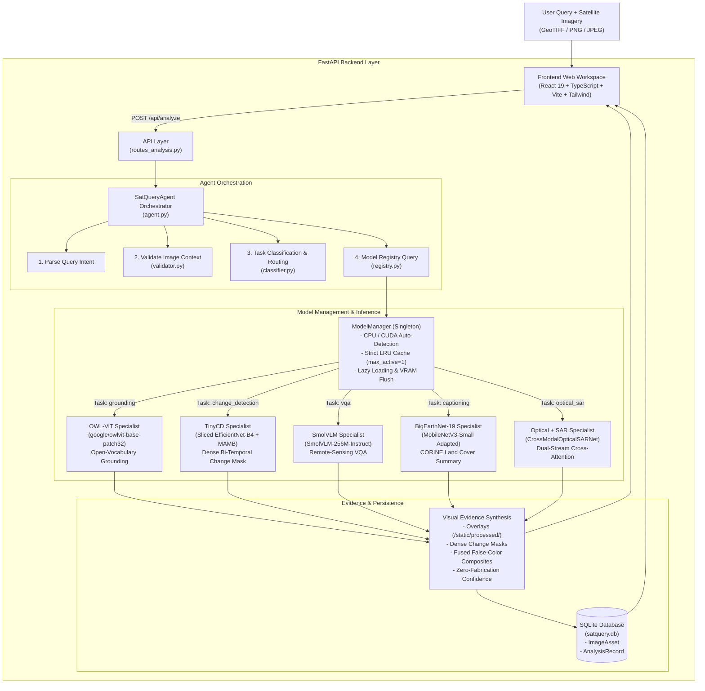

# SatQuery AI — System Architecture (ISRO SIH26167)

**Interactive Vision-Language Assistant for Multimodal Remote-Sensing Satellite Image Analysis**

Core Product Philosophy:
$$\text{"Don't choose the model. Just ask the question."}$$

---

## 1. High-Level Architectural Diagram

---

## 2. Core Architectural Subsystems

### A. Ingestion & Preprocessing Subsystem (`backend/app/services/ingestion.py`)
- **Format Handling**: Ingests multi-band GeoTIFF, standard TIFF, PNG, and JPEG.
- **Header-Only Metadata Extraction**: Reads raster headers via `tifffile` and PIL without pulling massive gigabyte arrays into RAM.
- **Sensor Modality Detection**: Determines `optical`, `sar`, or `multispectral` using band counts, radiometric depth, and user modality hints.
- **Web Preview Generation**: Generates 8-bit RGB preview tiles stored in `data/previews/` for low-latency browser rendering.

### B. Agentic Task Classifier & Routing Engine (`backend/app/services/classifier.py`)
- Automatically resolves natural language intent into one of 5 supported remote-sensing tasks:
  1. `grounding`: Text-guided feature localization ("Where are...", "Locate the...").
  2. `change_detection`: Bi-temporal surface comparison ("What changed between...", "Identify alterations...").
  3. `vqa`: Factual spectral/spatial inquiry ("Is this image...", "What type of environment...").
  4. `captioning`: Holistic scene description ("Describe this scene...", "Land cover summary...").
  5. `optical_sar`: Cross-modal synergy queries ("Compare optical and SAR...", "Using both radar and optical...").
- **Context-Aware Rejections**: Enforces strict preconditions (e.g. rejecting change queries with only 1 image, or rejecting optical-SAR queries without SAR imagery) before invoking heavyweight models.
- **Out-of-Scope Filter**: Detects and rejects unrelated requests (code generation, poetry, weather forecasts) with clear user feedback.

### C. Model Registry (`backend/app/models/registry.py`)
- Decouples client queries from model implementations.
- Maintains metadata, input constraints (single image, bi-temporal pair, optical-SAR pair), supported modalities, and backend types (`real`, `adapted`, `demo`).

### D. ModelManager & Single-Active LRU Cache (`backend/app/models/manager.py`)
- **Memory Safety**: Enforces `max_active_models=1` so that only one deep learning model is active in RAM/VRAM at a time.
- **Automatic Device Selection**: Auto-detects NVIDIA CUDA GPU with fallback to CPU.
- **Lazy Loading**: Models are instantiated only when explicitly routed to by the agent.
- **Active Offloading**: When switching specialists, older models are offloaded and garbage collection (`gc.collect()` and `torch.cuda.empty_cache()`) is immediately executed.

---

## 3. Real Specialist Model Stack

| Task | Specialist Model | Architecture | Weights / Checkpoint | Zero-Fabrication Confidence Derivation |
|---|---|---|---|---|
| **Change Detection** | **TinyCD** | Siamese Sliced EfficientNet-B4 + MAMB depthwise mixing + UpMask decoder | `HZDR-FWGEL/UCD-MNCD256-TinyCD` (1.15 MB safetensors) | Mean probability across detected change mask pixels: $C = \frac{1}{\|M\|}\sum_{(x,y) \in M} P(x, y)$ |
| **Visual Grounding** | **OWL-ViT** | Vision Transformer + Text Transformer dual encoder with cross-modal projection | `google/owlvit-base-patch32` (584 MB safetensors) | Raw sigmoid score from class query logits: $C = \sigma(\text{logit})$ |
| **Remote-Sensing VQA** | **SmolVLM-256M** | Idefics3 vision-language model with autoregressive causal decoder | `HuggingFaceTB/SmolVLM-256M-Instruct` (489 MB safetensors) | Mean softmax probability across generated tokens: $C = \frac{1}{T}\sum_{t=1}^T \max_v P(\text{token}_t = v)$ |
| **Scene Captioning** | **BigEarthNet-19** | Adapted MobileNetV3-Small classifier on 19 CORINE land-cover classes | `bigearthnet_adapted.pth` (5.99 MB, 92.89% val accuracy) | Top class sigmoid activation: $C = \sigma(z_{\text{top\_class}})$ |
| **Optical + SAR Fusion** | **CrossModalOpticalSARNet** | Dual-stream convolutional encoders + Bidirectional spatial cross-attention | `optical_sar_fusion.pth` (1.25 MB, 317k parameters) | Pearson correlation of Sobel edge gradients + Cross-attention coherence: $C = 0.5 \cdot \max(0, r_{\text{edge}}) + 0.5 \cdot \text{coherence}$ |

---

## 4. Frontend & Presentation Layer

- **Minimalist Workspace UI**: Built in React 19 + TypeScript + Vite + Tailwind CSS following the Stitch-approved design system.
- **Palette**: Desert Beige background (`#F2EFE7`), Deep Space Navy text/containers (`#0D1B2A`), Steel Slate accents (`#4E6B7C`), Soft Sky blue overlays (`#C8D9E6`).
- **Interactive Multi-Modal Evidence Components**:
  - `EvidenceViewer.tsx`: Interactive bounding box toggle, full-frame expansion, detector scores.
  - `ChangeComparison.tsx`: Side-by-side or split before/after viewer with real change mask overlay and alteration percentage.
  - `OpticalSarComparison.tsx`: Dual-sensor multispectral vs microwave backscatter cards with fusion summary.
  - `AnalysisTrace.tsx`: Collapsible step-by-step observable execution trace.
  - `HistoryView.tsx`: Full persistent analysis dialogues with search, filters, and real/adapted/demo badges.
